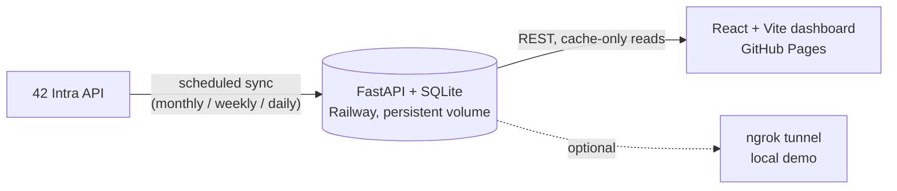

<div align="center">


# ft_WarsawStories

**A live community dashboard for 42 Warsaw** — student activity, coalition
standings, and project momentum, celebrated instead of buried in a spreadsheet.

[](https://github.com/Delta-43/42-Warsaw-Hacks-ft-Riders/actions/workflows/deploy-frontend.yml)
[](LICENSE)
[](backend/README.md)
[](frontend/README.md)

**[View the live dashboard →](https://delta-43.github.io/42-Warsaw-Hacks-ft-Riders/)**

</div>

<!--
  TODO: drop a real capture at docs/screenshot.png (16:9 works best), then
  uncomment the block below so it renders here.

<p align="center">
  
</p>
-->

## What is this

A 16:9 dashboard, built to run on a lobby screen or a browser tab, that
turns the 42 Intra API into something people actually want to look at:
who's on a hot streak, which coalition is winning, who just passed a
project. It polls a FastAPI + SQLite cache every minute so it stays live
without hammering the 42 API.

## Features

- **Stories carousel** — animated speech-bubble callouts for recent wins (project passes, logtime streaks)
- **Metrics island** — students on campus, achievements earned, and projects worked this week, at a glance
- **Momentum & standings charts** — logtime leaders and top-10-per-coalition rankings (Recharts)
- **Hero of the week / community shoutouts** — rotating spotlight on top performers and coalition standings
- **Cache-first backend** — every dashboard request is served from SQLite; the 42 API is only ever touched by scheduled background sync jobs, on monthly/weekly/daily cadences
- **Resilient to outages** — falls back to the last good cache (`stale_fallback`) if the upstream API is unreachable

## Architecture



| Layer | Stack | Hosting |
| --- | --- | --- |
| Frontend | React 19, TypeScript, Vite, Recharts, Framer Motion | GitHub Pages |
| Backend | FastAPI, SQLite (cache-first), scheduled sync jobs | Railway (persistent volume) |
| Data source | [42 Intra API](backend/docs/API_Research.md) | — |

## Getting started

```bash
# Backend — from backend/
chmod +x scripts/setup_backend.sh && ./scripts/setup_backend.sh
uvicorn main:app --reload --port 8000

# Frontend — from frontend/, in another terminal
npm install && npm run dev
```

Full setup (config, env vars, deployment, ngrok tunneling for demos) is in:

- [`backend/README.md`](backend/README.md) — backend setup, endpoints, deployment notes
- [`frontend/README.md`](frontend/README.md) — frontend setup and environment variables

## Docs

| Doc | What's in it |
| --- | --- |
| [`backend/docs/API_CONTRACT.md`](backend/docs/API_CONTRACT.md) | The stable endpoint contract the frontend relies on |
| [`backend/docs/API_Research.md`](backend/docs/API_Research.md) | How we scoped the 42 Intra API — endpoints, rate limits, response shapes |
| [`backend/docs/ExecutionPlan.md`](backend/docs/ExecutionPlan.md) | DB schema and sync job design |
| [`backend/docs/Notes.md`](backend/docs/Notes.md) | Early planning notes |

## License

[GNU AGPL v3](LICENSE)
